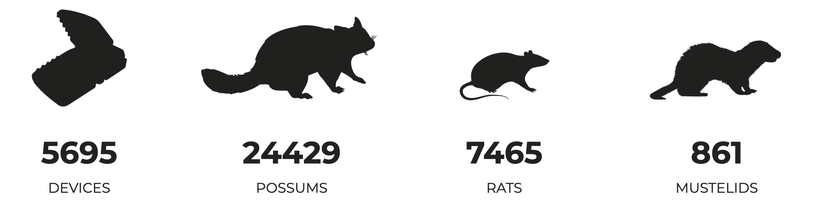

# Trap.NZ Counter

A counter that automatically pulls information from the <a href="https://trap.nz" target="_blank">Trap.NZ</a> API for single or multiple projects.

<a href="https://kimberleycollins.github.io/trapnzcounter/" target="_blank">https://kimberleycollins.github.io/trapnzcounter/</a>

Allows you to add base numbers to the total count, e.g. if catches have occured but are not currently stored within Trap.NZ.

Can be hosted on a website to show the total impact of predator control efforts.

Trap.NZ projects need to be public in order for this to work.

Developed by <a href="https://github.com/kimberleycollins" target="_blank">Kimberley Collins</a> (<a href="https://predatorfreedunedin.org" target="_blank">Predator Free Dunedin</a>) and <a href="https://github.com/cipscis" target="_blank">Mark Hanna</a> (Javascript savant) for anyone to use under a <a href="https://creativecommons.org/share-your-work/public-domain/cc0/" target="_blank">CC0 License</a>.
